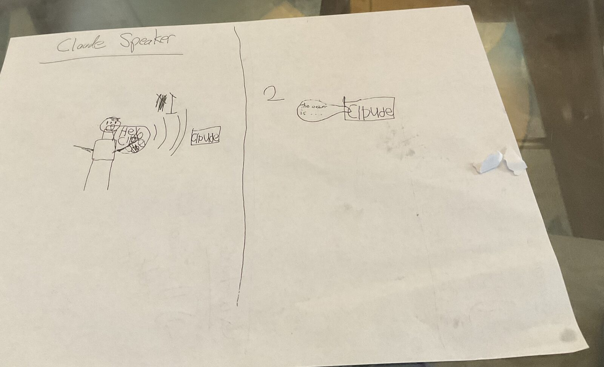
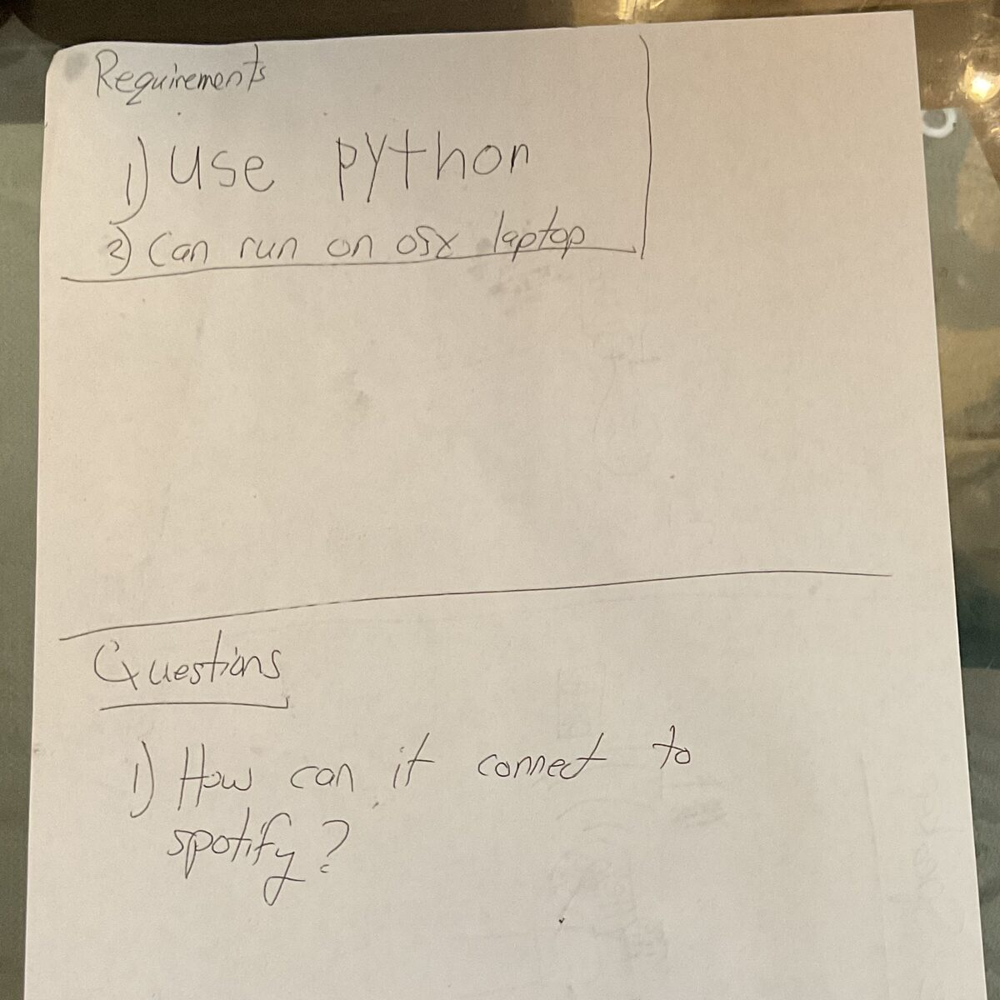

# Level 2 Programming

Tejas is six. He reads Level 2 books. Over a weekend he built a smart speaker:
you say "Hey Claude," ask a question out loud, and the laptop answers out loud.

He did not type a line of Python.

## It started on a sheet of paper



Two panels, drawn in pen. On the left, a stick figure says **"Hey Claude."**
Sound waves travel across the page into a box labeled *Claude*. On the right,
panel **2**, the box talks back: **"the answer is…"**

That is the entire product. A person talks, the box answers. The word *Claude*
is spelled a slightly different way nearly every time it appears on the page,
which does not make the design any less clear.

Then page two:



**Requirements**

1. use python
2. can run on osx laptop

**Questions**

1. How can it connect to spotify?

Look at what is on those two pages. A picture of the product. Two hard
constraints on how it gets built. One open question, written down instead of
guessed at.

That is a design document. It is missing nothing important.

## What happened next

The two photos went to [Claude Code](https://claude.com/claude-code), which
first turned them into a written design — the sketch expanded into modules,
interfaces, and a build order — and then wrote the code.

The finished thing is five small Python files and a loop:

```python
while True:
    wake.wait_for_wake()                     # listen for "Hey Claude"
    audio = audio_in.record_until_silence()  # record the question
    question = stt.transcribe(audio)         # Whisper, running locally
    answer = brain.ask(question)             # the Claude API
    tts.speak(answer)                        # say it out loud
```

Both requirements held. It is Python, and it runs on the laptop with no extra
hardware — the built-in microphone and the built-in speakers are the whole
device. Only one of those five steps uses the internet; the microphone, the
wake word, and the speech recognition all run on the machine, so the room is
not streamed anywhere until somebody actually says the wake word.

## The wake word was the hard part

The drawing says "Hey Claude," and the drawing is the specification.

The trouble is that openWakeWord — the small local detector that listens for
the phrase — ships with only a handful of pre-trained wake words, and "hey
claude" is not one of them. The honest options were to accept "hey jarvis" or
to train a new one.

We trained a new one, on the same laptop. No GPU, no cloud, and nobody had to
say "Hey Claude" into a microphone even once: a text-to-speech engine says the
phrase thousands of times in hundreds of different synthetic voices, a pile of
unrelated speech and music and noise serves as the counterexamples, and a small
network learns to tell the two apart. About a gigabyte of downloads and an hour
of waiting.

It wakes on "hey claude" at **0.997** confidence and stays under **0.005** on
ordinary conversation. It is not perfect — it likes some voices more than
others, and "hey **clyde**" scores 0.484, just under the line — but it works,
and it is a real model that did not exist before.

## Level 2

Children's books have a number printed on the cover. Level 1 is a few words a
page, with the picture doing most of the work. Level 2 is short sentences and a
real story, read mostly on your own, with somebody nearby for the hard words.
Level 3 is chapters.

Tejas reads Level 2.

Now look at that requirements page again. *use python.* *can run on osx laptop.*
*How can it connect to spotify?* Short declarative sentences. One idea each.
Nothing hedged, nothing subordinate, no sentence that needs a second reading.

That is Level 2 prose. It was also a complete enough specification to build
working software from.

Programming used to start at the other end of the shelf. Not Level 2, not even
the chapter books — the manuals. You could not make your first real thing until
you could read and write the way adults write for other adults: syntax, types,
stack traces, documentation. The distance between *wanting something* and
*being able to ask for it* was measured in years, and most people who wanted
something quit somewhere in the middle of that distance.

That distance is what collapsed. Not the difficulty of building software — the
reading level required to ask for it.

Asking well is still a real skill, and this is where the sketch is genuinely
good. It does every job a specification has to do:

- **It shows the product working**, from the outside, from the user's side.
- **It names the constraints that actually constrain** — Python, macOS laptop —
  and stays quiet about the hundred decisions that did not matter.
- **It writes down what nobody knows yet** instead of hiding it. *How can it
  connect to spotify?*

That last one is the most grown-up thing on the page. A question you have
written down is a question somebody else can answer. The Spotify answer turned
out to be tools: Claude does not play music itself, it asks our code to, and our
code calls Spotify. It went into the design document in full — and then it got
deferred, because getting the speaker talking was worth more than getting it
singing. Knowing which one to build first is a Level 2 skill too.

None of this says the hard part went away. Somebody still had to notice that the
wake word did not exist and go make one, and that was not a Level 2 job. But it
is no longer the *first* job. The first job is knowing what you want and being
able to say it in short sentences.

The drawing was the source code. Everything else was reading the hard words out
loud.

## What's next

Roughly in order of fun:

- Play music by voice — the Spotify question, finally answered out loud
- Weather, timers, web search
- Remembering conversations between runs
- A light that shows when it is listening
- Moving it off the laptop and onto a Raspberry Pi, so it is a real box sitting
  on a shelf — which is what the drawing showed all along
