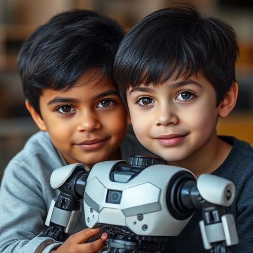

# Welcome to Jas Brothers Drones

## About Us

We are two brothers learning about the world by building advanced robots.

## Writing

- [Level 2 Programming](blog/level-2-programming.md) — a six-year-old drew a
  smart speaker on a sheet of paper. It turns out Level 2 is a high enough
  reading level to build one.
